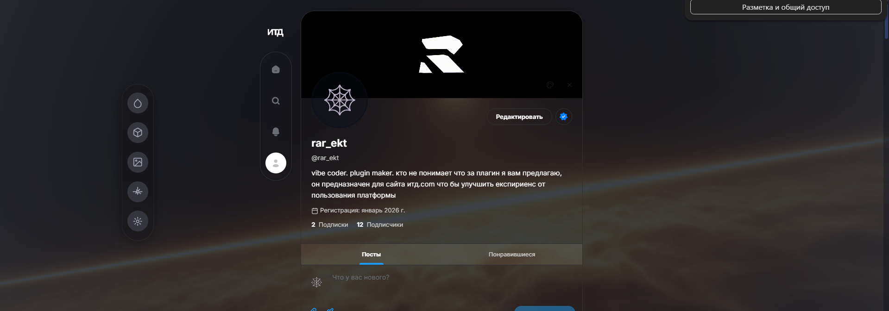

# ITD Banner Redraw Helper

Расширение для точного переноса изображения в область рисования на `itd.com` (включая `canvas.drawing-canvas`) с поддержкой анимированных GIF/MP4 баннеров, кастомных тем и WebGL шейдеров.

## 🎨 Основные возможности

### 🖼️ Баннер редактор
- Автонаходит целевой canvas (`800x267` в модалке рисования)
- Live-preview поверх области до применения
- Вписывание: `cover`, `contain`, `stretch`
- Точная настройка: масштаб, сдвиг X/Y, прозрачность
- Режимы точности цвета:
  - `Pixel Perfect` (без сглаживания, максимально точные пиксели)
  - `Smooth` (мягкое сглаживание)
- `Ctrl+V` на странице: вставка картинки из буфера и авто-применение в canvas
- Загрузка нескольких файлов сразу (`multiple`)

### 🎬 GIF/MP4 поддержка
- ✅ Полная поддержка анимированных GIF и MP4 баннеров
- ✅ Автоматическая замена PNG на GIF/MP4 при сохранении
- ✅ Поддержка файлов до 50+ МБ
- ✅ Предупреждения для больших файлов (>20 МБ, >50 МБ)
- ✅ Перехват `/api/files/upload` для подмены файлов
- ✅ Injected script для работы в контексте страницы

### 🎨 Кастомные темы
- Создание собственных цветовых схем
- Настройка основного, вторичного цвета и фона
- Градиентный режим с плавной анимацией (8 keyframes, 20s)
- Прозрачность фона (0-100%)
- Сохранение и загрузка тем
- Автоматическое применение последней темы при перезагрузке

### 🎭 Кастомные шрифты
- Загрузка TTF шрифтов через drag & drop
- Применение шрифта ко всему сайту
- Сохранение шрифта (base64) в chrome.storage
- Автоматическая загрузка при старте

### ✨ WebGL шейдеры (Shadertoy совместимость)
- Полная поддержка Shadertoy шейдеров
- WebGL 2.0 с fallback на WebGL 1.0
- Все Shadertoy uniforms: `iTime`, `iResolution`, `iMouse`, `iDate`, `iTimeDelta`, `iFrame`, `iChannelTime`, `iChannelResolution`, `iSampleRate`
- Автоматическая генерация 256x256 noise текстуры для `iChannel0-3`
- Поддержка функции `mainImage(out vec4 fragColor, in vec2 fragCoord)`
- Автозамена `texture()` на `texture2D()` для WebGL 1.0
- Синхронизация версий шейдеров (vertex и fragment)

#### 🔥 Multipass рендеринг
- Поддержка Buffer A/B/C/D и Image шейдеров
- Парсинг Shadertoy кода с маркерами `// Buffer A`, `// Buffer B`, `// Buffer C`, `// Buffer D`, `// Image`
- Ping-pong framebuffers для temporal reprojection
- Buffer outputs доступны в `iChannel0-3` для Image шейдера
- Предыдущий кадр буфера доступен в `iChannel0` для самого буфера

### 🤖 AI генерация постов
- Генерация текста через OpenAI-совместимый API (`/v1/chat/completions`)
- Автоматическая вставка в поле `Что у вас нового?`
- Поддержка MegaLLM и других провайдеров

## 📦 Установка

1. Открой Chrome: `chrome://extensions`
2. Включи `Режим разработчика`
3. Нажми `Загрузить распакованное расширение`
4. Выбери папку проекта (где лежит `manifest.json`)

## 🚀 Как использовать

### Баннер редактор
1. Открой окно `Рисование` на itd.com
2. Нажми иконку расширения
3. Нажми `Найти canvas (800x267)`
4. Выбери режим и параметры
5. Загрузи файл через `Изображение` или нажми `Ctrl+V`
6. Нажми `Применить в canvas`

### GIF/MP4 баннеры
1. Открой плавающую панель (кнопка справа)
2. Перейди в раздел "Баннер"
3. Загрузи GIF/MP4 файл через drag & drop
4. Нажми "Сохранить как GIF" или "Сохранить как MP4"
5. Плагин автоматически:
   - Применит файл на canvas
   - Найдёт кнопку "Сохранить"
   - Заменит PNG на GIF/MP4 в запросе
   - Отправит на сервер

### Кастомные темы
1. Открой плавающую панель → вкладка "Темы"
2. Выбери цвета (основной, вторичный, фон)
3. Настрой прозрачность фона (0-100%)
4. Включи "Градиентный режим" для анимации
5. Нажми "Применить" или "Сохранить тему"

### Кастомные шрифты
1. Открой плавающую панель → вкладка "Темы"
2. Включи чекбокс "Кастомный шрифт"
3. Перетащи TTF файл в drop zone
4. Шрифт применится ко всему сайту
5. Шрифт сохранится и загрузится при следующем визите

### WebGL шейдеры

#### Простые шейдеры
1. Открой плавающую панель → вкладка "Шейдеры"
2. Вставь код шейдера в текстовое поле
3. Нажми "Применить шейдер"

Пример простого шейдера:
```glsl
void mainImage(out vec4 fragColor, in vec2 fragCoord) {
    vec2 uv = fragCoord / iResolution.xy;
    vec3 col = 0.5 + 0.5 * cos(iTime + uv.xyx + vec3(0, 2, 4));
    fragColor = vec4(col, 1.0);
}
```

#### Multipass шейдеры (Buffer A/B/C/D + Image)
Для сложных шейдеров с несколькими проходами используй маркеры:

```glsl
// Buffer A
void mainImage(out vec4 fragColor, in vec2 fragCoord) {
    vec2 uv = fragCoord / iResolution.xy;
    vec4 prev = texture(iChannel0, uv); // Предыдущий кадр
    fragColor = prev * 0.98 + vec4(sin(iTime), cos(iTime), 0.5, 1.0) * 0.02;
}

// Image
void mainImage(out vec4 fragColor, in vec2 fragCoord) {
    vec2 uv = fragCoord / iResolution.xy;
    vec4 bufferA = texture(iChannel0, uv); // Результат Buffer A
    fragColor = bufferA;
}
```

**Правила:**
- Каждый буфер начинается с `// Buffer A`, `// Buffer B`, `// Buffer C`, `// Buffer D`
- Финальный шейдер начинается с `// Image`
- Buffer A/B/C/D рендерятся в framebuffers
- Предыдущий кадр буфера доступен в `iChannel0`
- Результаты буферов доступны в Image шейдере через `iChannel0-3`

#### Где брать шейдеры
1. **Shadertoy.com** - крупнейшая коллекция WebGL шейдеров
   - Открой любой шейдер на https://www.shadertoy.com/
   - Скопируй код из редактора
   - Вставь в плагин
   - Для multipass шейдеров: скопируй код каждого буфера и добавь маркеры

2. **Встроенные примеры** - в плагине есть готовые шейдеры:
   - `sea` - Pirates shader от IQ (океан с волнами)
   - `tunnel` - Raymarching туннель
   - `space` - Космический шейдер

3. **Создай свой** - используй Shadertoy как песочницу:
   - Создай шейдер на Shadertoy
   - Протестируй его
   - Скопируй в плагин

### AI генерация постов
1. Открой вкладку `itd.com`, раздел `Посты`
2. В popup укажи:
   - `AI API Endpoint` (например, `https://api.megallm.io/v1/chat/completions`)
   - `AI API Key` (твой ключ)
   - `AI Model` (например, `gpt-4`)
3. Введи тему поста
4. Нажми `Сгенерировать и вставить`
5. Текст автоматически вставится в поле поста

#### Как получить API ключ MegaLLM
1. Зайди через VPN если сайт не открывается
2. Регистрация: https://megallm.io/auth/signup
3. Dashboard: https://megallm.io/dashboard
4. Раздел `API Keys` → `Create New API Key`
5. Скопируй ключ `sk-mega-...`
6. Не публикуй ключ публично!

## 🛠️ Python скрипты для сжатия GIF

В проекте есть 2 скрипта для сжатия GIF:

### `compress-gif.py` (базовый)
Использует Pillow для простого сжатия:
```bash
py compress-gif.py input.gif output.gif --quality 85 --width 800
```

### `compress-gif-advanced.py` (продвинутый)
Использует ffmpeg и gifsicle для лучшего качества:
```bash
py compress-gif-advanced.py input.gif output.gif --quality high --fps 24
```

Подробнее в `GIF-COMPRESSION-GUIDE.md`

## 📝 Примечания

- Если страница масштабирована (zoom браузера), расширение учитывает пересчет CSS→canvas пикселей автоматически
- Шейдеры работают в фоновом режиме с `z-index: -1`, `opacity: 0.3`, `mix-blend-mode: screen`
- Кастомные темы и шрифты сохраняются в `chrome.storage.local`
- GIF/MP4 файлы отправляются через перехват `window.fetch` в контексте страницы

## 🐛 Известные проблемы

- Некоторые сложные Shadertoy шейдеры могут требовать дополнительных текстур
- Python скрипты сжатия могут давать разное качество в зависимости от исходного GIF
- Очень большие файлы (>50 МБ) могут долго загружаться

## 📄 Лицензия

MIT License - используй как хочешь!

---

**Версия:** 1.0.7  
**Дата:** 11 февраля 2026
